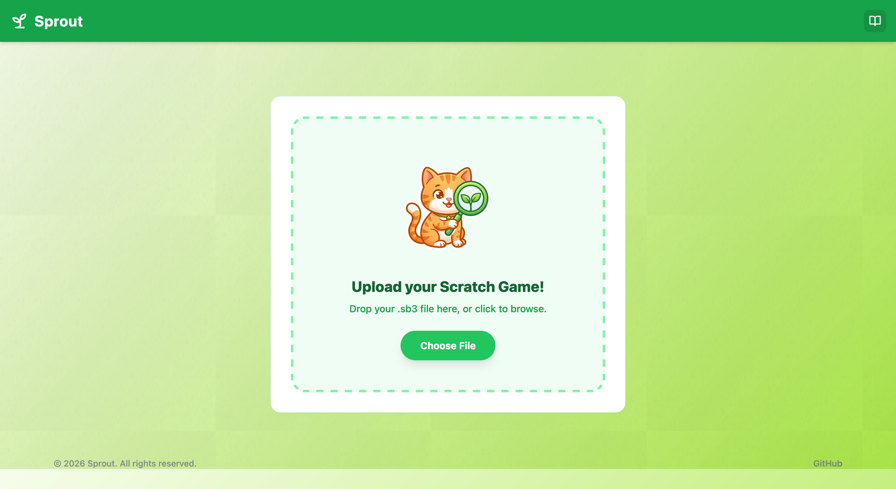
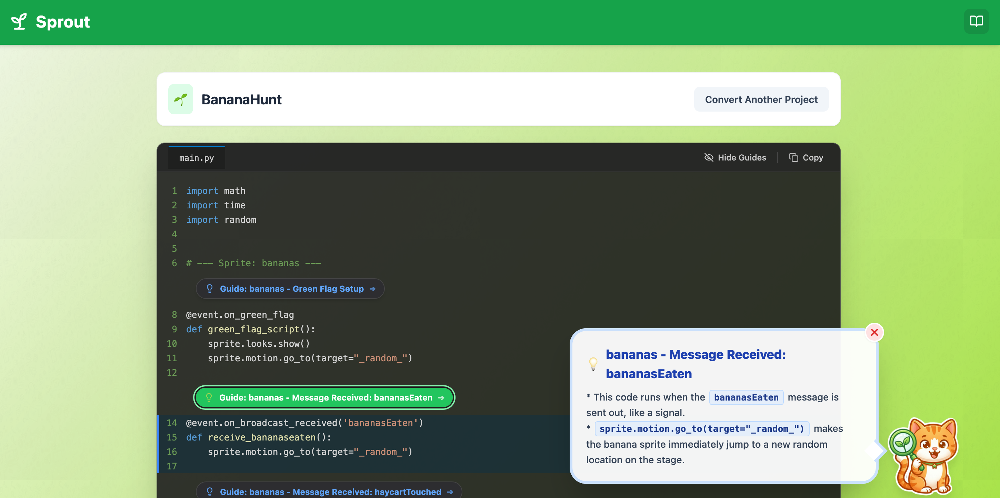
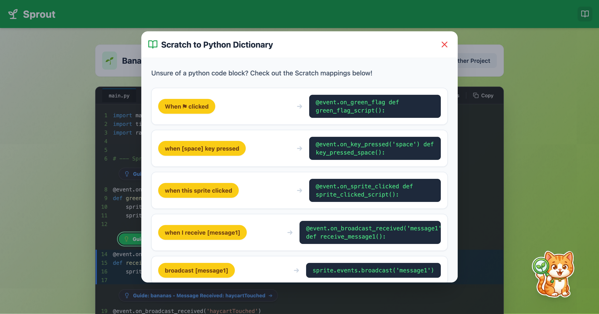

# 🌱 Sprout

**From Scratch to Python, with a Guide that Grows with You.**

Sprout is a transcompiler and educational platform designed to bridge the gap between block-based coding (Scratch) and professional text-based programming (Python). Built for the next generation of coders, Sprout doesn't just convert code. It teaches the invaluable logic behind the translation.

[View Live Status](https://stats.uptimerobot.com/XJcTACqmvk)

---

## 🚀 The Innovation

Unlike simple one-to-one mapping tools, Sprout utilizes a **Dual-Engine Architecture**:

1.  **The Transpilation Engine:** A custom-built Python logic layer that parses `.sb3` files, maps Scratch's asynchronous event-driven model to Pythonic syntax, and emits clean, readable code.
2.  **The AI Tutor Layer:** A context-aware explanation service powered by **Gemini 2.5 Flash**. It analyzes specific sections of the generated Python code to provide line-by-line, kid-friendly "hints" through an interactive "Srpout Cat" interface.

---

## 🛠 Tech Stack

### Frontend
* **React 19 & TypeScript:** A modern, type-safe foundation for a snappy UI.
* **Vite:** Ultra-fast build tooling.
* **Tailwind CSS:** Custom design system featuring "Glassmorphism" and a unique "Sprout" aesthetic.
* **Lucide React:** For clean, minimalist iconography.

### Backend
* **FastAPI (Python 3.13):** A high-performance asynchronous framework handling the heavy lifting.
* **Pydantic:** Strict data validation for Scratch project schemas and AI responses.
* **OpenAI Bridge / Gemini AI:** Leveraging LLMs for generative education.
* **Pytest:** Comprehensive suite for testing the transpilation logic.

### Deployment
* **Vercel:** Frontend hosting.
* **Render:** Backend hosting.
* **UptimeRobot:** Deals with Render free tier.

---

## 📂 Project Structure

```bash
.
├── frontend           # React + Vite application
│   ├── src/components # Interactive UI & Floating Tutor
│   ├── src/api        # Type-safe API client wrappers
│   └── src/assets     # Custom-designed brand assets (Sprout Cat!)
└── backend            # Python + FastAPI application
    ├── src/scratch    # .sb3 Loader & Block Index logic
    ├── src/transpile  # The Core: Translator & Emitter
    ├── src/ai         # Prompt engineering & AI Service layers
    └── src/schemas    # Pydantic models for cross-stack communication
```

---

## ✨ Key Features

* **Smart Mapping:** Maps Scratch "Green Flag" events, loops, and variables to standard Python libraries.
* **Interactive Explanations:** Click any section of the generated code to have **Sprout the Cat** explain what that specific block does.
* **Warning System:** Detects complex Scratch blocks that don't have direct Python equivalents and provides helpful banners.
* **Seamless UI:** A beautiful, responsive dashboard with a custom-tiled "doodle" background and a transparent, modern footer.

---

## 🛠 Local Installation & Setup

### Backend
1. `cd backend`
2. Create a `.env` file with your `GEMINI_API_KEY`.
3. `pip install -r requirements.txt`
4. `python src/sprout_backend/main.py`

### Frontend
1. `cd frontend`
2. `pnpm install`
3. `pnpm dev`

---

## 📸 Screenshots

### Home Screen


### Explanation Panel


### Interactive Dictionary

